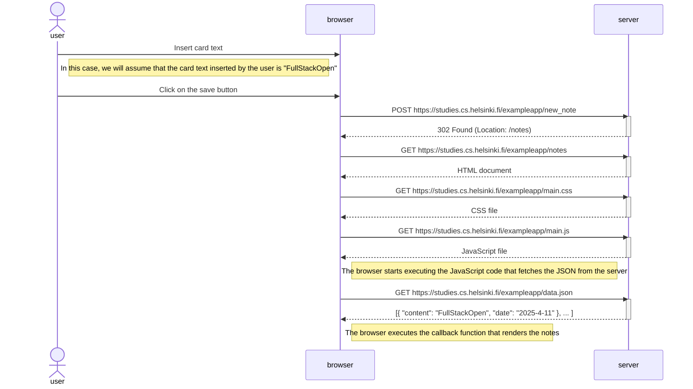

```mermaid
sequenceDiagram
    actor user
    participant browser
    participant server

    user->>browser: Insert card text
    Note right of user: In this case, we will assume that the card text inserted by the user is "FullStackOpen"
    user->>browser: Click on the save button

    browser->>server: POST https://studies.cs.helsinki.fi/exampleapp/new_note
    activate server
    server-->>browser: 302 Found (Location: /notes)
    deactivate server

    browser->>server: GET https://studies.cs.helsinki.fi/exampleapp/notes
    activate server
    server-->>browser: HTML document
    deactivate server

    browser->>server: GET https://studies.cs.helsinki.fi/exampleapp/main.css
    activate server
    server-->>browser: CSS file
    deactivate server

    browser->>server: GET https://studies.cs.helsinki.fi/exampleapp/main.js
    activate server
    server-->>browser: JavaScript file
    deactivate server

    Note right of browser: The browser starts executing the JavaScript code that fetches the JSON from the server

    browser->>server: GET https://studies.cs.helsinki.fi/exampleapp/data.json
    activate server
    server-->>browser: [{ "content": "FullStackOpen", "date": "2025-4-11" }, ... ]
    deactivate server

    Note right of browser: The browser executes the callback function that renders the notes
```