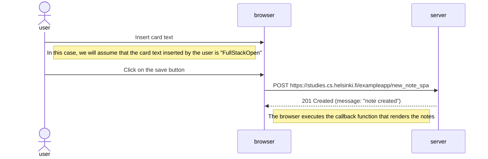

```mermaid
sequenceDiagram
    actor user
    participant browser
    participant server

    user->>browser: Insert card text
    Note right of user: In this case, we will assume that the card text inserted by the user is "FullStackOpen"
    user->>browser: Click on the save button

    browser->>server: POST https://studies.cs.helsinki.fi/exampleapp/new_note_spa
    activate server
    server-->>browser: 201 Created (message: "note created")


    Note right of browser: The browser executes the callback function that renders the notes
```